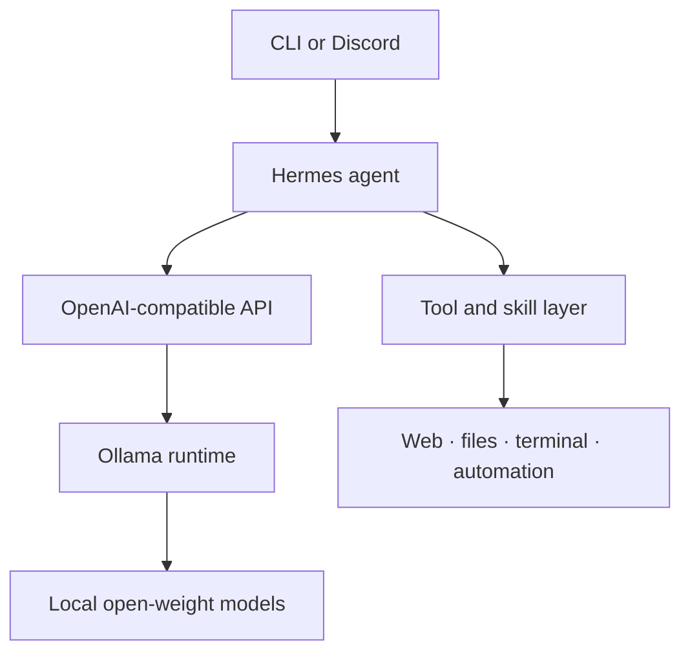

# Local-First AI Assistant

### Hermes · Ollama · Open-weight models · Linux automation

## Overview

This repository documents my work building and evaluating a local-first personal-assistant workflow around **Hermes**, **Ollama**, and open-weight language models.

The goal is not to train a foundation model. It is to integrate, operate, benchmark, and troubleshoot an assistant that can use tools reliably while keeping sensitive context on systems I control.

## What the project demonstrates

- Self-hosting models through an OpenAI-compatible Ollama endpoint
- Integrating web, terminal, file, memory, planning, and automation tools
- Providing persistent remote access through a Discord gateway
- Comparing models for speed, context length, vision, and tool use
- Designing scenario-based reliability tests with explicit pass/fail criteria
- Diagnosing authentication, session, service, and message-delivery failures
- Separating public documentation from private prompts, memory, credentials, and user data

## Architecture

See [docs/architecture.md](docs/architecture.md) for the component and trust-boundary notes.

## Hardware environment

| Component | Configuration | Role |
|---|---|---|
| **CPU** | Intel Core i5-13600KF | Host processing and CPU-offloaded model layers |
| **GPU** | AMD Radeon RX 9070, 16 GB VRAM | Local model inference |
| **Memory** | 32 GB DDR4 | Model allocation, context, and system workloads |
| **Operating system** | CachyOS | Daily-driver and assistant host |
| **Model runtime** | Ollama | Local model serving through an API |

## Model evaluation

I have tested dense and mixture-of-experts models across several quantizations. Measurements were collected during different experiments, so they are directional rather than a controlled leaderboard.

| Model | Observed decode speed | Notes |
|---|---:|---|
| `Qwen3.6 35B-A3B` | ~45 tok/s | 34.7B MoE, IQ3_S; tools, thinking, completion, and vision |
| `Qwen3.8 27B` | ~30–35 tok/s | 27.3B dense, IQ3_S; 106K configured context; tools, thinking, completion, and vision |
| `ornith-1.5:9b` | ~77–90 tok/s | Vision-capable model; results varied by test path |
| `gemma4:12b` | ~56 tok/s | Strong speed within available memory |
| `gemma4:26b` | ~45 tok/s | Larger model near the practical GPU-memory limit |
| `qwen3:30b-a3b` | ~30 tok/s | Mixture-of-experts instruct model |

Full context and caveats are in [benchmarks/model-results.md](benchmarks/model-results.md).

## Reliability testing

My reusable test suite checks whether a model can:

1. Follow an authoritative authentication helper and stop after success.
2. Handle a revoked token and stop at the user-authorization step.
3. Use a maintained service helper to diagnose, repair, and verify a failure.
4. Identify a missing required environment variable without unnecessary investigation.
5. Use current, authoritative sources for time-sensitive requests.

The scenarios and pass conditions are documented in [benchmarks/reliability-suite.md](benchmarks/reliability-suite.md). Private transcripts and credentials are intentionally excluded.

## Privacy and security

This repository contains documentation and sanitized examples only. It intentionally excludes:

- API keys, OAuth tokens, cookies, and service-account credentials
- Personal memory and private user context
- `SOUL.md` and other private behavioral prompts
- Session databases, logs, and Discord identifiers
- Live cron jobs and personal automation payloads
- Private configuration values and Google Workspace data

See [SECURITY.md](SECURITY.md) for the publication rules used by this project.

## Roadmap

- [x] Establish local inference through Ollama
- [x] Connect CLI and Discord workflows
- [x] Build repeatable reliability scenarios
- [x] Compare models under real assistant workloads
- [ ] Publish a sanitized configuration example
- [ ] Normalize benchmark prompts and measurement methodology
- [ ] Add architecture and workflow screenshots
- [ ] Add automated checks for accidental secrets

## Project status

This is an active portfolio and documentation project. The private assistant contains personal data and operational configuration, so this public-facing repository focuses on architecture, reproducible tests, measured results, and lessons learned rather than mirroring the live installation.
